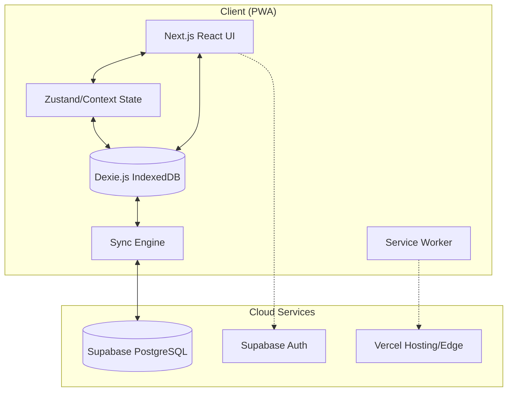
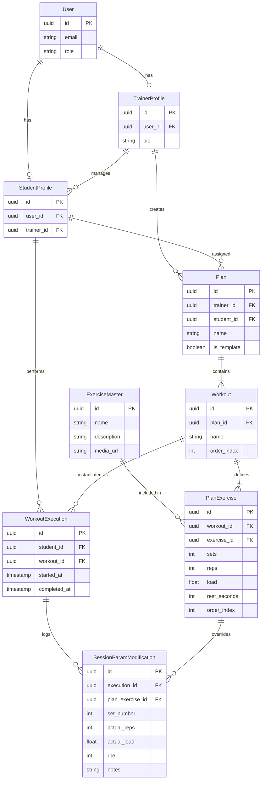

# Technical Design Document: Strength Trainer PWA

## 1. System Overview
The Strength Trainer PWA is a local-first application designed for high availability in gym environments with spotty connectivity. It uses a "Local-First" architecture where Dexie.js (IndexedDB) acts as the primary data source for the UI, ensuring near-instant interactions and full offline capability. Supabase provides the backend infrastructure for authentication, global data synchronization, and persistent storage.

## 2. Technology Stack & Frameworks
- **Frontend/PWA**: **Next.js (React)**
  - *Rationale*: Provides excellent SEO for public pages, robust routing, and built-in support for Service Workers via `next-pwa`.
- **Backend/DB/Auth**: **Supabase (PostgreSQL + RLS)**
  - *Rationale*: Rapid development with built-in Auth, Realtime capabilities, and Row Level Security (RLS) to ensure data privacy between trainers and students.
- **Offline Sync/Caching**: **Dexie.js (IndexedDB wrapper)**
  - *Rationale*: Provides a clean, Promise-based API for IndexedDB with robust indexing, making it ideal for managing complex training data locally.
- **Deployment**: **Vercel**
  - *Rationale*: Native integration with Next.js, providing edge functions and optimized asset delivery.

## 3. Architecture & Patterns
- **Local-First Pattern**: The application UI always interacts with Dexie.js. A background sync service monitors changes and pushes/pulls data to/from Supabase.
- **Repository Pattern**: Data access layers for Dexie and Supabase are abstracted to allow the UI to remain agnostic of the underlying sync logic.
- **State Management**: React Context or Zustand for UI state; Dexie for persistent application state.
- **Conflict Resolution**: "Student-Wins" strategy for session data. If a plan is modified by a trainer while a student is offline, the student completes their session with the cached plan, and a "Plan Updated" notification appears upon completion.

## 4. Data Models & Schemas
The database follows a relational structure optimized for both global libraries and individual session tracking.

### Core Entities:
- **User**: Managed by Supabase Auth, linked to profiles.
- **TrainerProfile**: Stores trainer-specific metadata.
- **StudentProfile**: Stores student metadata and links them to a primary trainer.
- **ExerciseMaster**: Global library of exercises (managed by Admins).
- **Plan**: A collection of workouts assigned to a student or saved as a template.
- **Workout**: A specific session (e.g., "Upper Body A") containing multiple exercises.
- **WorkoutExecution**: A record of a student performing a workout.
- **SessionParamModification**: Tracks on-the-fly changes (load/reps/RPE) made during a specific execution.

## 5. Security & Performance Considerations
- **Authentication**: Supabase Auth (Email/OTP) for secure onboarding.
- **Authorization**: PostgreSQL Row Level Security (RLS) ensures:
  - Students only see their own plans and executions.
  - Trainers only see their own students' data.
  - Admins can manage the `ExerciseMaster`.
- **Performance**: 
  - Dexie indices on `workout_id` and `student_id` for fast lookups.
  - Lazy-loading of exercise media to preserve local storage.
  - Optimistic UI updates for all logging actions.

## 6. Testing Strategy
- **Unit Testing**: Vitest for business logic and data transformation utilities.
- **Integration Testing**: Playwright for testing the Sync Engine and Service Worker behavior.
- **E2E Testing**: Cypress for critical user journeys (Trainer creating a plan -> Student executing it offline).

## 7. Diagrams

### System Architecture

### Database ER Diagram

