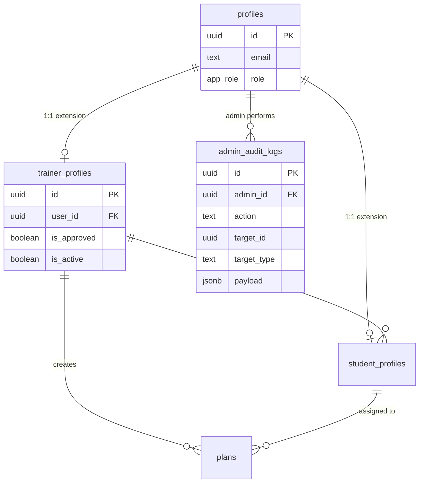
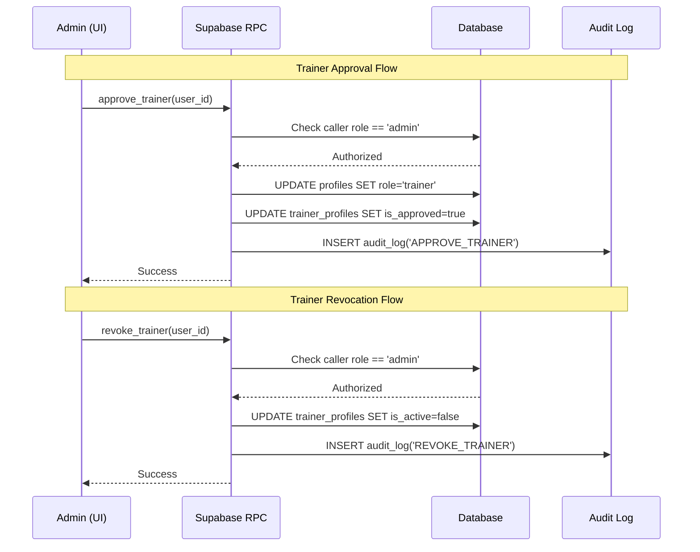

# Technical Design Document: Expanded Admin Dashboard (V2)

## 1. System Overview
The Expanded Admin Dashboard (V2) transitions the platform from a simple exercise management tool to a comprehensive administrative console. It provides high-level metrics, trainer lifecycle management, global student visibility, and a tamper-resistant audit trail. The architecture prioritizes security and data integrity, ensuring that administrative actions are strictly controlled and logged.

## 2. Technology Stack & Frameworks
- **Frontend**: Next.js (App Router) with Tailwind CSS and Lucide Icons.
- **Backend**: Supabase (PostgreSQL, Auth, RLS).
- **Database**: PostgreSQL with specialized RPC functions for administrative workflows.
- **Rationale**: Utilizing Supabase's built-in RLS and RPC allows for "thick database" security where business logic for sensitive operations (like role changes) is encapsulated within the database layer, reducing the risk of frontend-based bypasses.

## 3. Architecture & Patterns
- **Server-Side Driven**: Admins interact directly with Supabase. Offline-first (Dexie.js) is not required for admin functions.
- **RPC Pattern**: Complex actions (approval, revocation) are handled via Supabase RPC functions marked as `SECURITY DEFINER` to allow administrative overrides while strictly checking the caller's role.
- **Audit Pattern**: All state-changing administrative actions are recorded in a dedicated `admin_audit_logs` table.
- **RLS Hardening**: All tables will have explicit policies for the `admin` role, ensuring full visibility where required.

## 4. Data Models & Schemas

### 4.1 Schema Updates
```sql
-- trainer_profiles updates
ALTER TABLE trainer_profiles ADD COLUMN is_approved BOOLEAN DEFAULT false;
ALTER TABLE trainer_profiles ADD COLUMN is_active BOOLEAN DEFAULT true;

-- Admin Audit Logs
CREATE TABLE admin_audit_logs (
    id UUID PRIMARY KEY DEFAULT gen_random_uuid(),
    admin_id UUID REFERENCES profiles(id) NOT NULL,
    action TEXT NOT NULL,
    target_id UUID,
    target_type TEXT,
    payload JSONB,
    created_at TIMESTAMPTZ DEFAULT NOW() NOT NULL
);

-- Enable RLS
ALTER TABLE admin_audit_logs ENABLE ROW LEVEL SECURITY;
```

### 4.2 RPC Functions
- `get_admin_metrics()`: Returns aggregate counts for exercises, trainers (total/pending), and students.
- `approve_trainer(target_user_id UUID)`: 
  - Validates caller is 'admin'.
  - Updates `profiles.role` to 'trainer'.
  - Sets `trainer_profiles.is_approved = true`.
  - Creates audit log.
- `revoke_trainer(target_user_id UUID)`: 
  - Validates caller is 'admin'.
  - Sets `trainer_profiles.is_active = false`.
  - Creates audit log.

## 5. Security & Performance Considerations
- **Authorization**: All Admin RPCs and RLS policies will verify that `auth.uid()` corresponds to a profile with `role = 'admin'`.
- **Audit Integrity**: The `admin_audit_logs` table will have no `UPDATE` or `DELETE` policies, making it append-only.
- **Soft Deletion**: Revoking a trainer uses `is_active = false`. This preserves foreign key relationships, ensuring that students' historical `plans` and `workout_executions` are not orphaned or deleted.
- **Indexing**: Add indexes on `profiles(role)`, `trainer_profiles(is_approved, is_active)`, and `admin_audit_logs(created_at)`.

## 6. Testing Strategy
- **Unit Testing**: Test RPC functions via SQL scripts to ensure role-based access control works as expected.
- **Integration Testing**: Verify that calling `approve_trainer` correctly updates both `profiles` and `trainer_profiles` in a single transaction.
- **UI Testing**: Ensure Admin views are inaccessible to users with 'trainer' or 'student' roles.

## 7. Diagrams

### 7.1 Updated ERD


### 7.2 Admin User Flows

